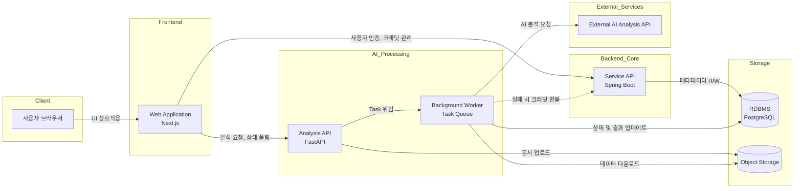

# AI 학습 지원 기능 구현 문서

본 문서는 학습 자료(PDF, 문서 등)를 기반으로 사용자의 학습 효율을 극대화하기 위해 제공되는 핵심 AI 기능들의 내부 파이프라인과 시스템 아키텍처를 상세히 기술합니다. 모놀리식 구조의 한계를 벗어나 역할 기반으로 분리된 백엔드 시스템과, 대용량 데이터를 안정적으로 처리하기 위한 비동기 파이프라인 설계에 초점을 맞추고 있습니다.

---

## 1. 전체 시스템 아키텍처

본 시스템은 대용량 파일 업로드, 장시간이 소요되는 AI 분석, 그리고 실시간 상태 업데이트를 안정적으로 처리하기 위해 컴포넌트별로 관심사를 분리(Separation of Concerns)하여 설계되었습니다.



### 컴포넌트별 역할 설명
* **Web Application (Next.js):** 사용자 인터페이스 제공 및 낙관적 업데이트(Optimistic UI)를 통한 매끄러운 UX 제공. 장시간 소요되는 분석 작업의 진행 상태를 주기적으로 폴링하여 사용자에게 시각적 피드백을 제공합니다.
* **Service API (Spring Boot):** 회원 인증, 결제 및 크레딧 관리, 게시판 등 서비스의 핵심 비즈니스 로직을 담당합니다. 트랜잭션 관리가 중요한 데이터를 다룹니다.
* **Analysis API & Background Worker (FastAPI 기반):** 파일 파싱 및 AI 분석 요청 수신을 담당합니다. 분석 요청이 들어오면 HTTP 응답 지연(Timeout)을 방지하기 위해 즉시 Task ID를 반환하고, 실제 무거운 AI 파이프라인은 Background Job Worker로 위임하여 비동기 처리합니다.
* **Storage (PostgreSQL & Object Storage):** 원본 문서 파일과 페이지별 추출 이미지는 비용 효율적인 Object Storage에 저장하고, 분석된 텍스트 결과물과 태스크 메타데이터는 RDBMS(PostgreSQL)에 저장하여 데이터의 성격에 맞게 저장소를 분리했습니다.

---

## 2. AI 분석 파이프라인 (공통 기반)

대용량 문서 처리 시 발생하는 컨텍스트 유실(Lost in the Middle) 현상과 환각(Hallucination) 현상을 방지하기 위해, 모든 분석 모드는 기본적으로 다단계(Multi-Phase) 계층적 파이프라인 구조를 공유하거나 변형하여 사용합니다.

```mermaid
flowchart TD
    Start([요청 수신 및 데이터 로드]) --> CacheCheck{이전 분석 캐시<br/>존재 여부}
    
    CacheCheck -->|Miss| Phase0[Phase 0<br/>의미론적 앵커 설정<br/>(문서 뼈대 추출)]
    Phase0 --> Phase1[Phase 1<br/>배치 단위 심층 분석<br/>(청크 분할)]
    
    CacheCheck -->|Hit| Phase2[Phase 2<br/>결과 합성 및 보강]
    Phase1 --> Phase2
    
    Phase2 --> PostProcess[출력 포맷 정제 및 후처리]
    PostProcess --> End([DB 저장 및 완료])
```

아래 각 모드별 상세 파이프라인은 이 공통 뼈대를 바탕으로, 목적에 맞게 로직을 최적화한 형태입니다.

---

## 3. 강의 복습 모드

**기능 목적:** 대학 강의 등 방대한 분량의 학습 자료를 논리적으로 구조화하여, 원리와 배경지식이 포함된 심도 있는 복습용 리포트를 제공합니다.

```mermaid
flowchart TD
    In([분석 요청 및 학습자 프로필 입력]) --> P0[Phase 0: 전체 뼈대 및 구조 분석<br/>(Semantic Anchor 생성)]
    P0 --> P1[Phase 1: 페이지 배치 분할 및 심층 분석<br/>(멀티모달 이미지 + 구조 뼈대 동시 주입)]
    P1 --> P2[Phase 2: 추출된 블록 병합 및 최종 리포트 합성]
    P2 --> Ext[외부 검색 API 연동<br/>(참고 영상/문서 Grounding 보강)]
    Ext --> Out([마크다운 정제 및 DB 저장])
```

* **사용자 입력값:** 대상 문서 ID, 분석 페이지 범위, 학습자 프로필(지식 수준, 학습 목적, 정보 취향 등).
* **처리 흐름:** 사용자 프로필을 반영한 Multi-Phase 파이프라인 실행 → 계층적 마크다운 생성 → 외부 참고 문서 링크(Grounding) 추가 → 결과 반환.
* **핵심 로직 (백엔드/API):** 
  * 분석 범위를 일정 단위의 배치(Batch)로 나누어 병렬/순차적으로 외부 AI API에 처리 요청을 보냅니다.
  * 입력된 학습자 프로필(예: "입문자", "스토리 중심")을 시스템 프롬프트에 주입하여, 생성되는 텍스트의 어조, 깊이, 예시의 종류를 동적으로 조절합니다.
* **저장 데이터:** 생성된 최종 마크다운 텍스트 덩어리를 RDBMS에 저장합니다.
* **기술적 포인트:**
  * **멀티모달(Multimodal) 컨텍스트 유지:** 텍스트뿐만 아니라 슬라이드 내의 다이어그램이나 도표 이미지를 AI에 함께 전달하여 시각 자료에 대한 묘사를 본문에 자동으로 통합합니다.
  * **외부 검색(RAG/Grounding) 통합:** 학습 자료에 누락된 배경지식을 채우기 위해 파이프라인 마지막 단계에서 자체적인 검색 로직을 실행, 신뢰할 수 있는 외부 링크(유튜브 영상, 학술 블로그 등)를 결과에 매핑합니다.

---

## 4. 핵심 요약 모드

**기능 목적:** 시험 직전 등 짧은 시간 안에 핵심 개념과 공식, 정의만을 빠르게 파악하기 위해 문서의 정보를 고밀도로 압축합니다.

```mermaid
flowchart TD
    In([분석 요청 및 범위 지정]) --> P0[Phase 0: 핵심 주제 및 출제 포인트 추출]
    P0 --> P1[Phase 1: 디테일 가지치기 및 정보 압축<br/>(Pruning & Condensing)]
    P1 --> P2[Phase 2: 고밀도 포맷 합성<br/>(표, 불릿 포인트 중심의 마크다운 강제)]
    P2 --> Out([마크다운 정제 및 DB 저장])
```

* **사용자 입력값:** 대상 문서 ID, 분석 범위.
* **처리 흐름:** 뼈대 분석 → 디테일 가지치기(Pruning) 및 핵심 키워드 중심 매핑 → 불릿 포인트 중심의 요약본 합성.
* **핵심 로직 (백엔드/API):**
  * '강의 복습 모드'와 파이프라인 골격은 유사하지만, 프롬프트 엔지니어링을 통해 응답의 정보 깊이(Depth)를 엄격히 제한합니다.
  * 불필요한 예시나 장황한 서술을 제거하고, 비교 표(Table)나 짧은 리스트(List) 형태로 반환하도록 출력 구조를 강제합니다.
* **저장 데이터:** 고도로 압축된 마크다운 텍스트를 RDBMS에 저장합니다.
* **기술적 포인트:**
  * **레이턴시 및 토큰 최적화:** 복습 모드에 비해 처리해야 할 출력 토큰 수가 적으므로, 빠른 응답성에 최적화된 경량 모델 파라미터나 짧은 타임아웃 설정을 적용하여 시스템 자원 소모를 최소화합니다.

---

## 5. 문제 생성 모드

**기능 목적:** 학습한 내용을 즉각 점검할 수 있도록, 업로드한 자료의 팩트에 기반한 객관식/주관식 퀴즈를 동적으로 생성합니다.

```mermaid
flowchart TD
    In([요청: 범위, 난이도, 유형 지정]) --> Cache{이전 추출 팩트<br/>캐시 확인}
    
    Cache -->|Miss| Step1[Step 1: 문맥 내 팩트/명제 증류<br/>(Fact Distillation)]
    Step1 --> SaveCache[(추출 팩트 DB 캐싱)]
    SaveCache --> Step2
    
    Cache -->|Hit| Step2[Step 2: 퀴즈 동적 합성<br/>(사용자 파라미터 적용 및 문제 생성)]
    
    Step2 --> Parse[JSON 스키마 파싱 및 Fallback 정제]
    Parse --> Out([구조화된 JSON 객체 DB 저장])
```

* **사용자 입력값:** 출제 범위(페이지), 문제 난이도, 문제 유형(객관식, T/F 등), 출제 개수.
* **처리 흐름:** 팩트 증류(Distillation) 단계 → 퀴즈 구조 합성 단계 → JSON 스키마 파싱 및 정제.
* **핵심 로직 (백엔드/API):**
  * **2-Step 분리 구조:** 원본 문서를 바로 문제로 만들면 엉뚱한 내용을 지어내는 환각에 취약해집니다. 따라서 1단계에서 문서를 순수한 '명제(Proposition)와 팩트' 단위로 추출하고, 2단계에서 이 검증된 팩트만을 재료로 삼아 퀴즈를 생성하는 2-Step 아키텍처를 채택했습니다.
  * 출력을 순수 JSON 포맷으로 강제하여 프론트엔드에서 즉시 렌더링 가능한 형태로 구성합니다.
* **저장 데이터:** 생성된 퀴즈 데이터를 구조화된 JSON 형태로 직렬화하여 RDBMS에 저장합니다.
* **기술적 포인트:**
  * **구조화된 데이터 파싱 안정성:** AI가 반환한 응답에서 마크다운 백틱(```json) 등에 오염되지 않은 순수 JSON 객체만을 안전하게 추출하기 위해 정규표현식(Regex)을 활용한 견고한 Fallback 파싱 로직을 구현했습니다.
  * **FinOps 및 캐싱 고도화:** 동일 문서 범위에 대해 사용자가 난이도만 바꿔 퀴즈를 재요청할 경우를 대비하여, 무거운 연산인 1단계(팩트 증류) 결과물을 DB에 임시 캐싱합니다. Cache Hit 발생 시 2단계 연산만 수행하므로 API 호출 비용과 응답 시간을 대폭 절감했습니다.

---

## 6. 예외 처리 및 안정성 설계

외부 AI API 의존성이 높은 아키텍처 특성상, 안정적인 서비스 제공을 위해 강력한 예외 처리 메커니즘을 구축했습니다.

* **실패 케이스 및 재시도 전략 (Retry Strategy):**
  * 외부 API의 일시적 오류(429 Too Many Requests, 503 Service Unavailable) 발생 시, 지수 백오프(Exponential Backoff) 알고리즘을 적용하여 Background Job 내에서 자동으로 안전하게 재시도합니다.
  * 페이지 수가 과도하게 많은 문서 요청은 워커 진입 전에 필터링하여 사용자에게 분할 요청을 안내하는 Fast-fail 처리를 수행합니다.
* **AI 응답 검증 및 후처리:**
  * 반환된 텍스트에 포함된 깨진 서식, 렌더링 오류 유발 문자, 보안 지시문 유출 시도 등을 CPU-bound 스레드 풀에서 정규표현식으로 정제(Sanitization)합니다. 이벤트 루프 블로킹을 피하기 위해 비동기 환경 내 스레드로 격리하여 실행합니다.
* **보상 트랜잭션 적용 (Saga Pattern의 간소화):**
  * 분석 태스크가 타임아웃 등의 이유로 최종 실패할 경우, FastAPI 워커 로직에서 즉시 Spring Boot API의 `Refund` 엔드포인트를 호출하여 사용자의 크레딧을 환불합니다. 외부 시스템 오류가 사용자의 서비스 자산 손실로 이어지지 않도록 데이터 정합성을 강제합니다.

---

## 7. 포트폴리오에서 강조할 구현 포인트

본 시스템 구현을 통해 증명할 수 있는 주요 기술적 역량은 다음과 같습니다.

* **관심사 분리 및 마이크로서비스 지향 설계:** 비즈니스 로직(Spring Boot)과 무거운 연산/AI 처리(FastAPI)를 분리하여 시스템 결합도를 낮추고 각 컴포넌트의 독립적인 스케일 아웃(Scale-out)을 가능하게 했습니다.
* **비동기 큐(Task Queue)를 활용한 대규모 트래픽 대응:** HTTP의 동기적 타임아웃 제약을 극복하기 위해 Background Worker를 도입하여, 장시간 소요되는 AI 분석 작업을 안정적으로 오케스트레이션했습니다.
* **AI 파이프라인 엔지니어링 역량:** '단일 프롬프트'에 의존하는 단순한 API 호출 방식을 넘어, Multi-Phase 배치 분석 및 2-Step 팩트 증류 방식을 직접 고안하여 LLM의 환각(Hallucination) 현상을 제어하고 결과의 논리적 무결성을 확보했습니다.
* **비용 최적화(FinOps) 및 캐싱 전략:** 변동성이 적은 분석 중간 산출물(뼈대 데이터, 팩트 추출물 등)을 고유 해시 키 기반으로 RDBMS에 캐싱하여, 중복 요청 시 불필요한 API 호출을 방지하고 레이턴시를 획기적으로 개선했습니다.
* **회복 탄력성(Resilience) 설계:** 외부 API 장애 시 자동 재시도, 실패 시 크레딧 보상 트랜잭션 실행, 응답 형식 파싱 실패 시의 Fallback 정제 등 시스템의 내결함성(Fault Tolerance)을 다각도로 확보했습니다.
