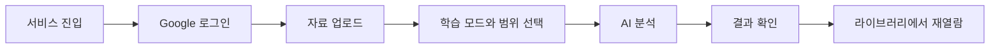

# 사용자 흐름과 핵심 기능

## 1. 시작과 로그인

사용자는 서비스 소개 화면에서 분석 흐름을 시작할 수 있습니다. 분석을 실행하려면 Google 로그인을 진행하며, 이미 준비한 파일과 설정을 이어서 사용할 수 있도록 흐름을 구성합니다.

## 2. 자료 준비

업로드 가능한 자료 형식은 `PDF`, `PPTX`, `DOCX`이며, 파일당 최대 크기는 `100MB`입니다. 사용자는 분석 전에 학습 목적과 필요한 페이지 범위를 선택합니다.

## 3. 학습 모드

| 모드 | 사용 목적 |
| --- | --- |
| 강의 복습 | 강의 내용을 순서와 맥락에 따라 다시 살펴봅니다. |
| 핵심 요약 | 중요한 개념을 빠르게 확인하고 시험 대비에 활용합니다. |
| 문제 생성 | 질문을 풀며 이해 정도를 확인합니다. |

## 4. 분석 진행

분석은 즉시 화면을 멈추게 하는 작업이 아니라, 진행 상태를 확인할 수 있는 작업 흐름으로 처리됩니다. 사용자는 분석 중임을 확인하고, 완료되면 선택한 모드에 맞는 결과 화면으로 이동합니다.

## 5. 결과 확인

작업 화면에서는 정리 결과와 원본 자료를 연결해 확인합니다. 모바일에서는 작은 화면에서 핵심 학습 결과가 먼저 읽히도록 원본과 결과의 이동 방식, 표 가독성, 액션 배치를 정리합니다.

## 6. 라이브러리

생성된 자료는 라이브러리에서 다시 열람할 수 있습니다. 모바일에서는 저장된 자료를 빠르게 탐색할 수 있도록 목록 정보와 카드 조작 범위를 단순하게 유지합니다.

## 사용 흐름 요약

