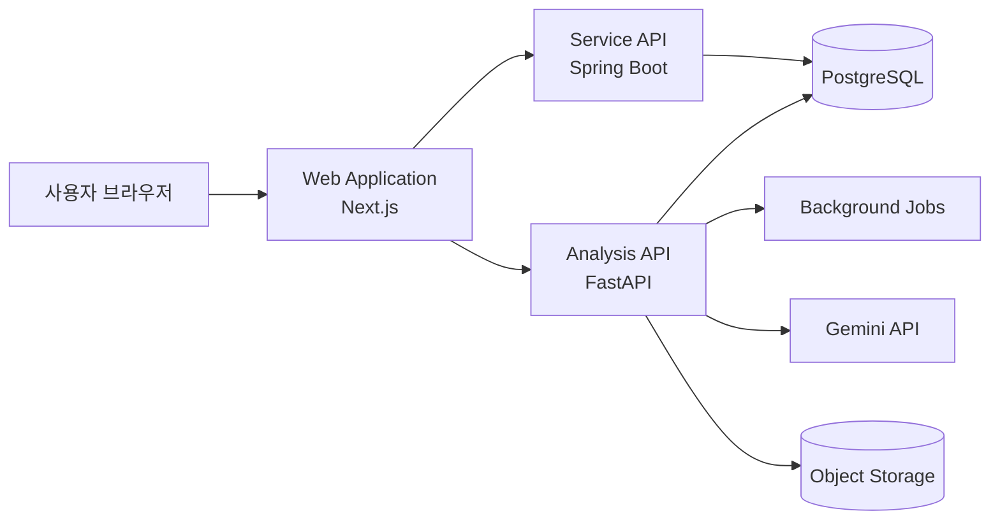

# 전체 아키텍처

## 구성 원칙

모릭(Mori-Q)는 사용자 화면, 서비스 API, AI 분석 작업을 역할별로 분리합니다. 이를 통해 화면 개선과 분석 처리 개선이 서로 과도하게 얽히지 않도록 유지하고, 분석처럼 시간이 필요한 작업을 웹 요청 하나에 묶지 않도록 설계했습니다.

## 시스템 구성

## 구성 요소별 책임

| 구성 요소 | 역할 |
| --- | --- |
| Web Application | 랜딩, 로그인 흐름, 업로드, 학습 설정, 작업 화면, 라이브러리 UI 제공 |
| Service API | 사용자 인증 연계, 이용 상태와 서비스 데이터 처리 |
| Analysis API / Jobs | 파일 처리, 분석 요청 접수, 비동기 진행 및 결과 생성 |
| PostgreSQL | 서비스 상태와 결과 조회에 필요한 구조화 데이터 저장 |
| Object Storage | 업로드 자료 및 화면 제공에 필요한 파일 자원 관리 |
| Gemini API | 선택된 학습 목적에 맞는 AI 결과 생성 지원 |

## 배포 환경

웹, 서비스 API, AI 분석 서비스는 컨테이너 기반으로 각각 배포되며, Google Cloud Run 환경에서 운영됩니다. 데이터 저장은 Cloud SQL(PostgreSQL)과 Cloud Storage를 사용합니다.

## 공개하지 않는 범위

이 아키텍처는 서비스 역할 수준만 표현합니다. 실제 네트워크 경로, 인증 키, 저장 경로 규칙, 요청 데이터 형태, 분석 내부 조건은 보안과 서비스 고유 구현 보호를 위해 공개하지 않습니다.
